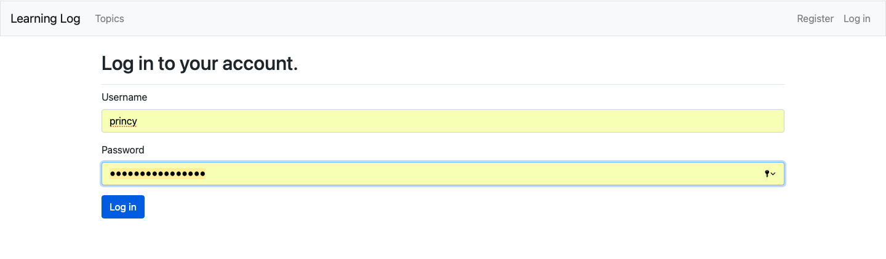
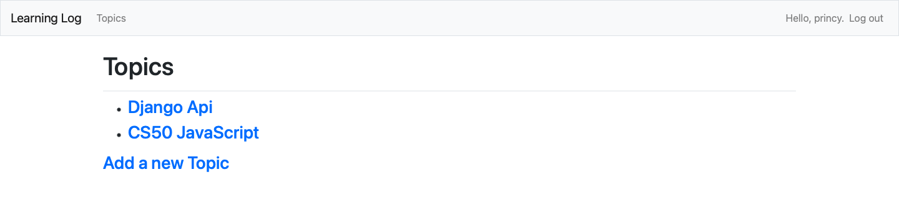
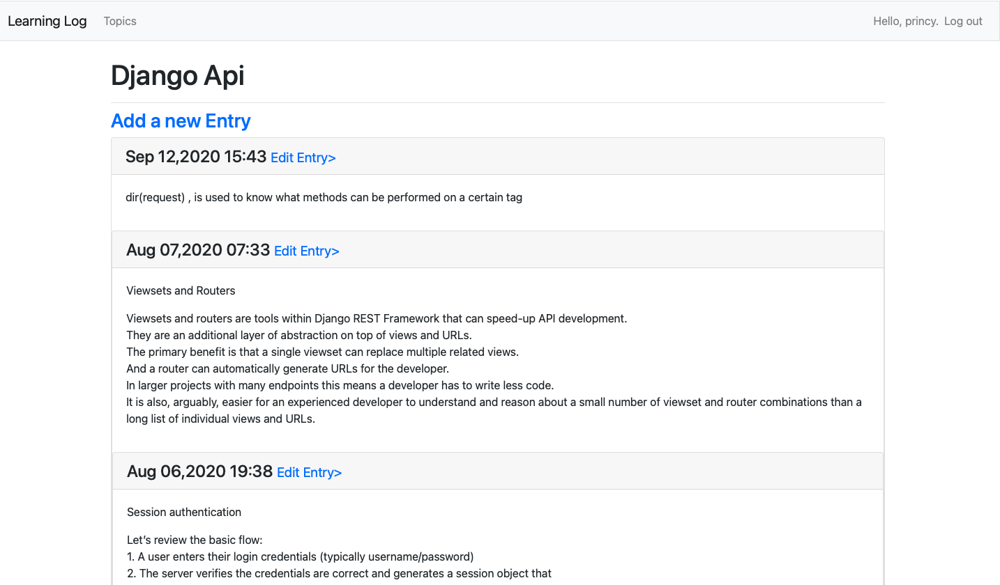
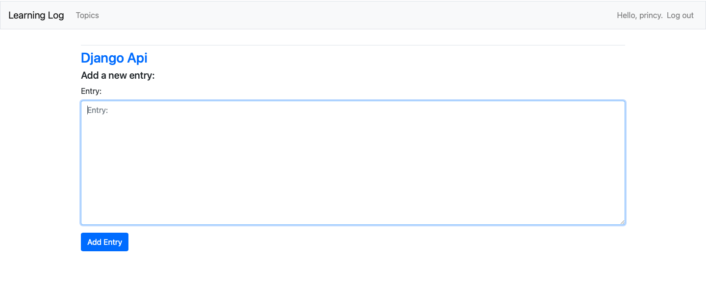

# learning-log
keep track of your learning
https://learning--logger.herokuapp.com - automatic!
[Learning-Log](https://learning--logger.herokuapp.com)

### Login Page

### Topics Page

### Entry Page

### Add Entry Page

### You can create topics and then make notes on it
